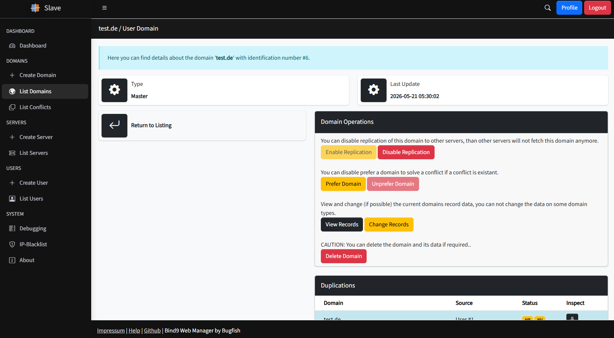
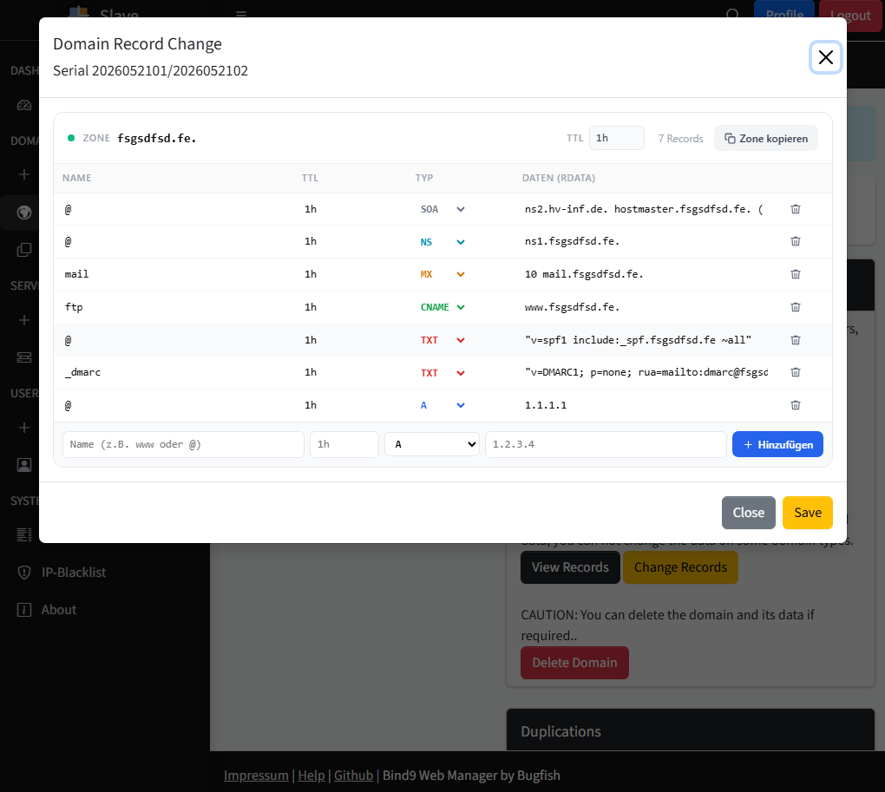
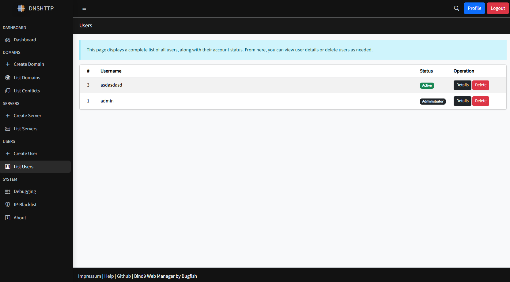
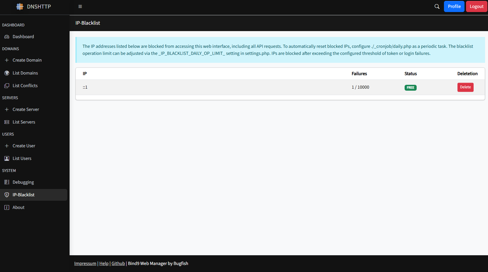
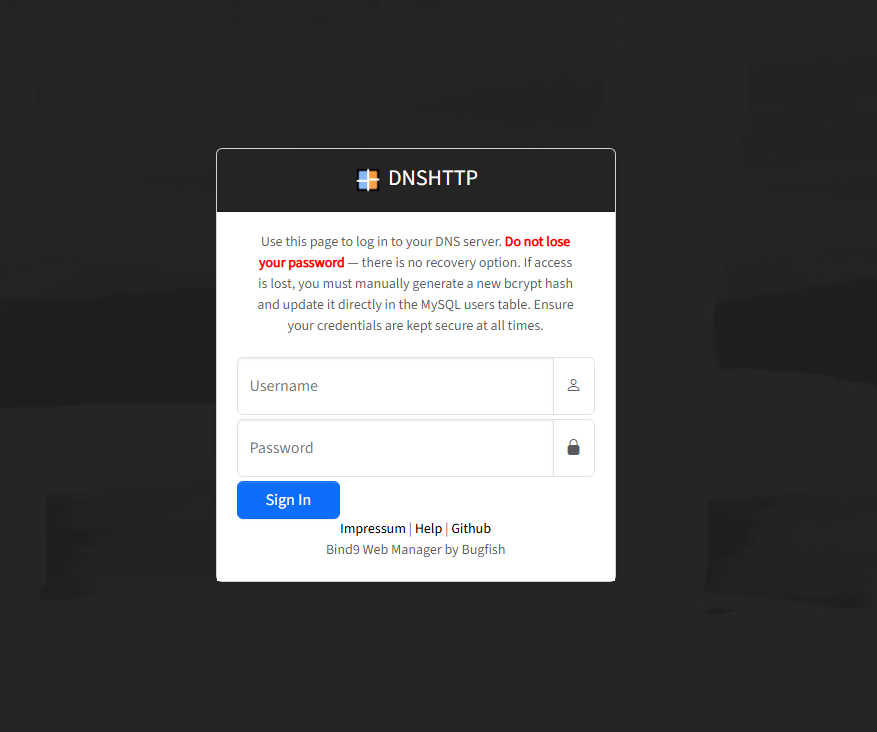

# Bind9 Web Manager [DNSHTTP]

> [!TIP]
> No new features are currently planned for this project. However, users are welcome to create issues or feature requests, which will be reviewed and responded to within 1–3 weeks.

## 🚀 Introduction

Bind9 Web Manager (DNSHTTP) is a web-based management interface for BIND9 DNS servers. It centralizes domain and record management, server replication, security controls, and operational insights into a single platform — making DNS administration more straightforward for both single-server setups and multi-server architectures.


DNSHTTP supports hybrid server configurations, where a single server acts as both a Master and a Slave simultaneously. This is useful for reducing infrastructure complexity while still maintaining proper replication across your DNS architecture.

To set up a hybrid environment, deploy the software on both servers. On the Master server, configure the Slave Server entry, and on the Slave server, configure the Master Server entry. Once both sides are configured, the servers can replicate with each other bidirectionally as needed.



DNSHTTP can operate as a dedicated DNS control panel alongside existing hosting panels such as Virtualmin, Plesk, ISPConfig, and others — managing your Bind9 DNS layer independently without interfering with your existing stack🔌. In Docker environments, only the standalone deployment is supported, which is also the case when installing via the setup script .

---

## 🔥 Features

Delivers the essential tools to effectively manage your site’s content, structure, and user roles—streamlined for simplicity, without unnecessary complexity. For a broad overview of its capabilities, refer to the feature list below.

### 📋 Domain and Record Management
 
The core of DNSHTTP is its domain and DNS record management. You can add, edit, and remove domains along with all of their associated DNS records directly through the web interface, without manually editing zone files or reloading services by hand.



### 🛡️ Access Control

The software features a robust user and group management system, enabling administrators to efficiently create, organize, and manage both users and user groups. With flexible permission controls, administrators can assign specific access rights to groups and individual users, ensuring secure and streamlined management of user privileges across the platform.



### 🔄 Slave Server Replication
 
DNSHTTP gives you direct control over the replication process between your Master and Slave DNS servers, with real-time status updates so you can monitor the state of your replication at a glance.
 
- The **Domains Section** displays both replicated slave domains and locally mastered domains side by side.
- **Conflicts** occur when the same domain exists as both a master and a slave entry. These are automatically detected, clearly highlighted, and can be resolved through the dedicated **Conflicts** section.


### 🚫 IP Blacklisting
 
DNSHTTP includes built-in IP blacklisting to help protect your DNS infrastructure from suspicious or unauthorized activity. When a threat is identified, the offending IP can be banned directly through the interface. Bans can be lifted manually at any time, or you can set up the `blacklist.php` cronjob to automate blacklisting resets on a scheduled basis.



### 📊 Replication Insights
 
Beyond basic replication controls, DNSHTTP provides detailed insights into the state of your replication and domain configuration. This gives you the visibility needed to make informed decisions, catch issues early, and proactively manage your DNS replication strategy across all connected servers.


### 🔌 External API
 
DNSHTTP exposes an API interface secured with tokens, allowing external systems and scripts to perform DNS operations programmatically. This makes it straightforward to integrate DNS management into your existing workflows, automation pipelines, or third-party tooling.



### 🖥️ Integrated Installer 

The installation process is simplified through a clear and intuitive graphical user interface (GUI), making setup quick and accessible for users with minimal technical experience. Additionally, advanced users can choose from alternative installation methods such as Docker containers or automated scripts, providing flexible deployment options to suit different environments and preferences.


---

## 🗒️ Requirements 

Below are the requirements for the webserver. Additional default installed linux and php modules are required as openssl and more, usually they are already installed by default and so not listed here.

| Requirement | Minimum Value | Recommended Value |
|-------|----------|---|
| Server Root Access | Required | - |
| Linux Package: bind9 | Required |- |
| Linux Package: cron | Required |- |
| Linux Package: bind9-utils | Required |- |
| Linux Package: dnsutils | Required |- |
| Linux Package: php8.2(+) | Required |- |
| Apache2 Module: headers | Required |- |
| Apache2 Module: rewrite | Required |- |
| PHP Memory Limit | 128M |256M |
| PHP Max Post Size | 128M |256M |
| PHP Max Execution Time | 180s |600s |
| PHP Module: MySQLi | Enabled | - |
| PHP Module: JSON | Enabled | - |
| PHP Module: mbstring | Enabled | - |
| PHP Module: cURL | Enabled | - |
| PHP Module: intl | Enabled | - |
| PHP Module: session | Enabled | - |

---

## 🛠️ Installation 

You can see detailed information at the installation documentation page at: [https://bugfishtm.github.io/Bind9-Web-Manager/installation.html](https://bugfishtm.github.io/Bind9-Web-Manager/installation.html). Choose the method that best fits your hosting environment and needs.
 
 The initial user account created for the website during installation serves as the primary administrator. This account has full access to configure and manage the system. It is important to secure this account by updating its credentials promptly after installation to protect the site from unauthorized access. 
 
🧍 **Initial username:** admin 
🔑 **Initial password:** changeme  

Consider setting up additional user accounts with appropriate roles and permissions to ensure proper administration and security management going forward.

### ✋ Manual

> ⚠️ It is highly recommended to change the admin password immediately after installation.

Installing the Bind9 Web Manager is straightforward. For detailed instructions on manual installation, please refer to the documentation located in the index.html file within the repository's docs folder, or visit https://bugfishtm.github.io/Bind9-Web-Manager/installation_manual.html.

### 🐳 Docker

> ⚠️ It is highly recommended to change the admin password immediately after installation.

This method installs the standalone version of DNSHTTP. This ensures a secure and isolated installation suitable for most web use cases. For Docker installation, visit: https://hub.docker.com/r/bugfishtm/dnshttp.

### 📄 Script

> ⚠️ It is highly recommended to change the admin password immediately after installation.

This script is intended for use only on freshly installed servers. In the github repository's `_scripts` folder, you'll find an installation script designed to install the full version with all features on a dedicated server.  Execute the following Commands and navigate through the installation shell process to install DNSHTTP.

```bash
curl -o ./installer.sh https://raw.githubusercontent.com/bugfishtm/Bind9-Web-Manager/refs/heads/main/_scripts/installer.sh
chmod u+x ./installer.sh  
sh ./installer.sh install
```

This script is intended for users who wish to utilize standalone functionality on a fresh system.

---

## 📖 Documentation

The following documentation is intended for both end-users and developers.

| Description | Link  | Scope  |
|----------------|----------------------------|--------|
| DNSHTTP Tutorial Videos | [https://www.youtube.com/playlist?list=PL6npOHuBGrpChSvani3MESZnzuKwwxz4o](https://www.youtube.com/playlist?list=PL6npOHuBGrpChSvani3MESZnzuKwwxz4o)| Developers/Users |
| DNSHTTP Tutorial Videos (Local) | ./_videos | Developers |
| DNSHTTP Documentation | [https://bugfishtm.github.io/Bind9-Web-Manager/](https://bugfishtm.github.io/Bind9-Web-Manager/)| Developers/Users |
| DNSHTTP Documentation (Local) | ./docs/index.html | Developers/Users |
| Bugfish Framework Documentation                                                                                        | [https://bugfishtm.github.io/Bind9-Web-Manager/extra-framework/](https://bugfishtm.github.io/Bind9-Web-Manager/extra-framework/)  | Developers |
| Bugfish Framework Documentation (Local) | ./docs/extra-framework/index.html | Developers |

Relevant github repositories related to Bind9 Web Manager.

| Description | Link  | Scope  |
|----------------|----------------------------|---|
| Bind9 Web Manager | [https://github.com/bugfishtm/Bind9-Web-Manager](https://github.com/bugfishtm/Bind9-Web-Manager)| Developers |
| Bugfish Framework | [https://github.com/bugfishtm/bugfish-framework](https://github.com/bugfishtm/bugfish-framework)| Developers |

Relevant docker repositories related to Bind9 Web Manager.

| Description | Link  | Scope  |
|----------------|----------------------------|--------|
| DNSHTTP Docker Image  | [https://hub.docker.com/r/bugfishtm/dnshttp](https://hub.docker.com/r/bugfishtm/dnshttp) | Users |

---

## 📁 Repository Structure 

This table provides an overview of key files and folders related to the repository. Click on the links to access each file for more detailed information. If certain folders are missing from the repository, they are irrelevant to this project.

| Document Type | Description |
|----|-----|
| .git/ | Internal file, that can be ignored. |
| .github/ | Internal file, that can be ignored. |
| [.github/CODE_OF_CONDUCT.md](./.github/CODE_OF_CONDUCT.md) | community guidelines for participation. |
| _archive/ | Folder for storing archived or deprecated files. |
| _changelogs/ | Folder containing changelogs for version tracking. |
| _configuration/ | Settings.php configuration examples for different environments. |
| _docker/ | Folder with Docker-related files for building images. |
| _images/ | Folder containing project images and graphics. |
| _licenses/ | Folder with third-party license information. |
| _releases/ | Folder containing release versions of the project. |
| _screenshots/ | Folder with screenshots of the project. |
| _scripts/ | Folder for additional scripts and utilities. |
| _source/ | Folder containing the main source code. |
| _videos/ | Folder with project-related videos. |
| docs/ | Folder for documentation and guides. |
| .gitattributes | Internal file, that can be ignored. |
| .gitignore | Internal file, that can be ignored. |
| repository_reset.bat | Internal file, that can be ignored. |
| repository_update.bat | Internal file, that can be ignored. |
| [CHANGELOG.md](CHANGELOG.md) | Internal file, that can be ignored. |
| [CONTRIBUTING.md](CONTRIBUTING.md) |  contributors instruction file. |
| [SECURITY.md](SECURITY.md) |  security and warranty file. |
| [LICENSE.md](LICENSE.md) |  license file. |
| [README.md](README.md) |  readme file. |

---


## 💬 Support Channels

If you encounter any issues or have questions while using this software, feel free to contact us:

- **GitHub Issues** is the main platform for reporting bugs, asking questions, or submitting feature requests: [https://github.com/bugfishtm/Bind9-Web-Manager/issues](https://github.com/bugfishtm/Bind9-Web-Manager/issues)
- **Discord Community** is available for live discussions, support, and connecting with other users: [Join us on Discord](https://discord.com/invite/xCj7AEMmye)  
- **Email support** is recommended only for urgent security-related issues: [security@bugfish.eu](mailto:security@bugfish.eu)

---

## 📢 Spread the Word

Help us grow by sharing this project with others! You can:  

* **Tweet about it** – Share your thoughts on [Twitter/X](https://twitter.com) and link us!  
* **Post on LinkedIn** – Let your professional network know about this project on [LinkedIn](https://www.linkedin.com).  
* **Share on Reddit** – Talk about it in relevant subreddits like [r/programming](https://www.reddit.com/r/programming/) or [r/opensource](https://www.reddit.com/r/opensource/).  
* **Tell Your Community** – Spread the word in Discord servers, Slack groups, and forums.  

---


## 📑 Changelog Information

Refer to the _changelogs folder for detailed HTML changelogs tracking updates across versions. These changelogs are also included in GitHub Releases for easy access.

---

## 🌱 Contributing to the Project

Thank you for your interest in this project.

At this time, this repository is **not open for external contributions**.  
Please do **not** submit pull requests or patches.

- Pull requests from external contributors are not accepted.
- Any unsolicited pull requests will be closed without review.
- All code in this repository is maintained by the project owner.
- By design, no third‑party code will be merged into this project via GitHub.

If you encounter a bug or have an enhancement suggestion, please check the "Issues" section of our GitHub repository or visit our official website for guidance before beginning any work on it.

---

## 🤝 Community Guidelines

We’re focused on developing innovative solutions and advancing technology. By being part of this, you contribute to our progress.

Positive guidelines include being kind, empathetic, and respectful in all interactions. It is important to engage thoughtfully and offer constructive, solution-oriented feedback. Fostering an environment of collaboration, support, and mutual respect is essential.

Unacceptable behaviors include harassment, hate speech, or offensive language. Personal attacks, discrimination, or any form of bullying are not tolerated. Sharing private or sensitive information without explicit consent is strictly prohibited.

Together, we can partner to achieve common goals by following guidelines designed to promote effective collaboration and positive teamwork.

---

## 🛡️ Security Policy

I take security seriously and appreciate responsible disclosure. If you discover a vulnerability, please follow these steps:

- **Do not** report it via public GitHub issues or discussions. Instead, please contact the [security@bugfish.eu](mailto:security@bugfish.eu) email address directly.  
- Provide as much detail as possible, including a description of the issue, steps to reproduce it, and its potential impact.  

I aim to acknowledge reports within **2–4 weeks** and will update you on our progress once the issue is verified and addressed.

This software is provided as-is, without any guarantees of security, reliability, or fitness for any particular purpose. We do not take responsibility for any damage, data loss, security breaches, or other issues that may arise from using this software. By using this software, you agree that We are not liable for any direct, indirect, incidental, or consequential damages. Use it at your own risk.


---


## 📜 License Information

The license for this software can be found in the [LICENSE.md](LICENSE.md) file. Third-party licenses are located in the ./_licenses folder. The software may also include additional licensed software or libraries.

🐟 Bugfish 
