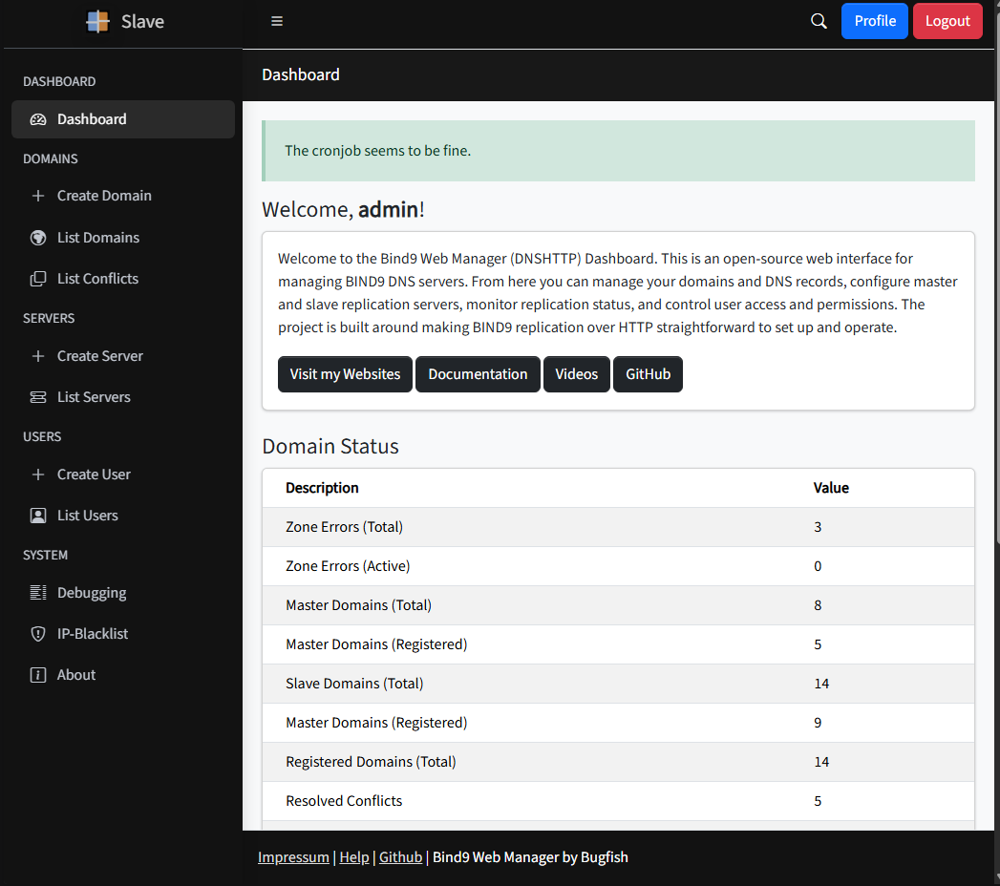
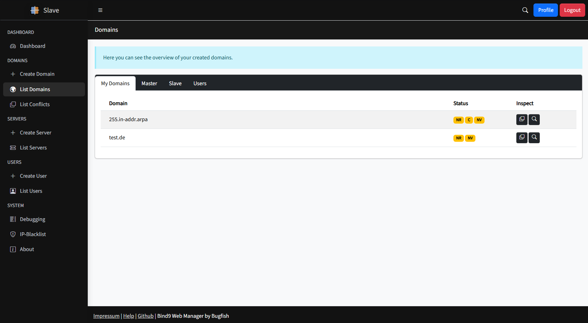
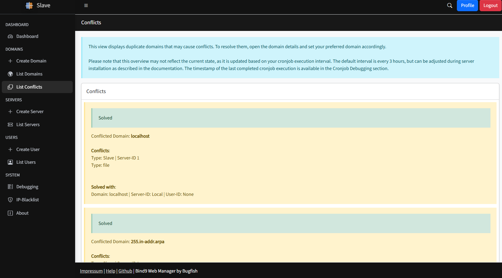
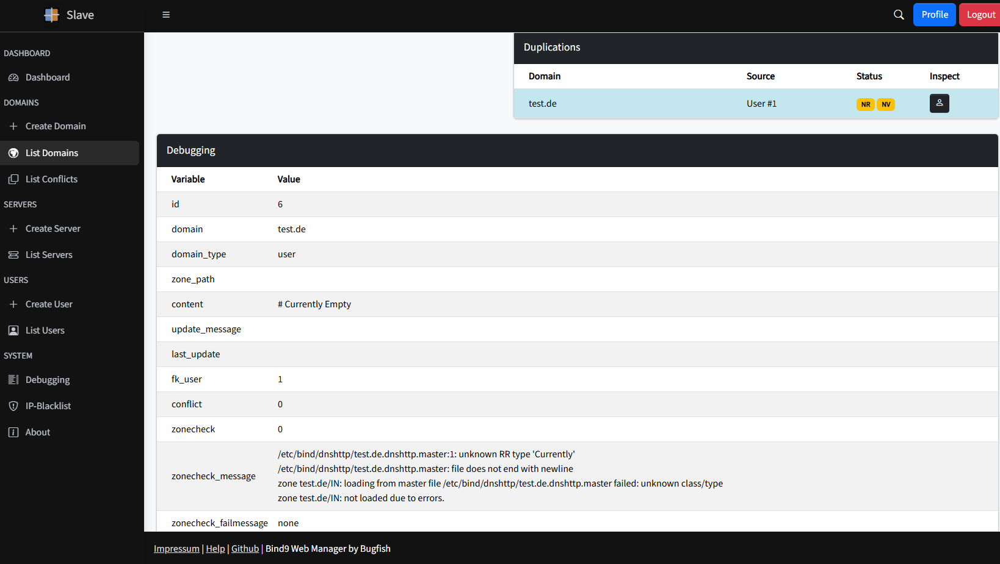
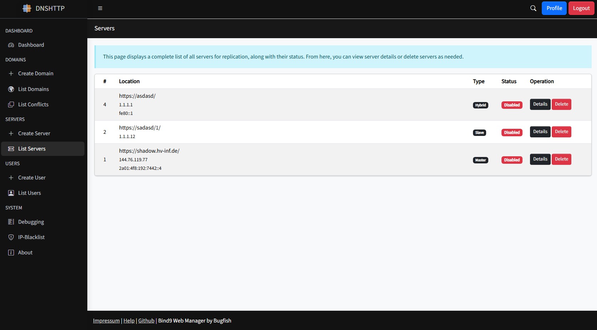
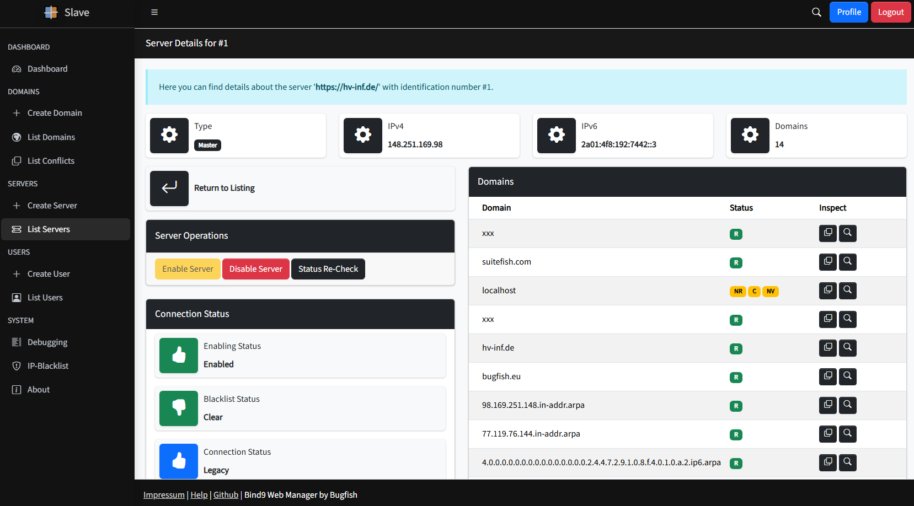
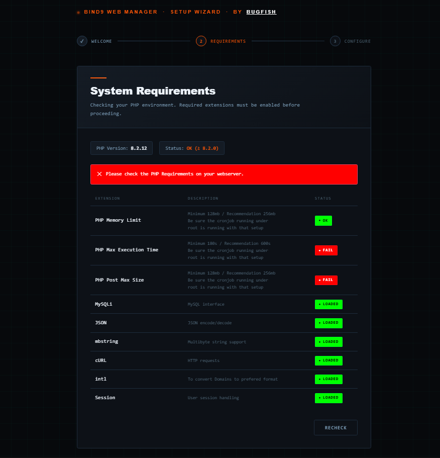
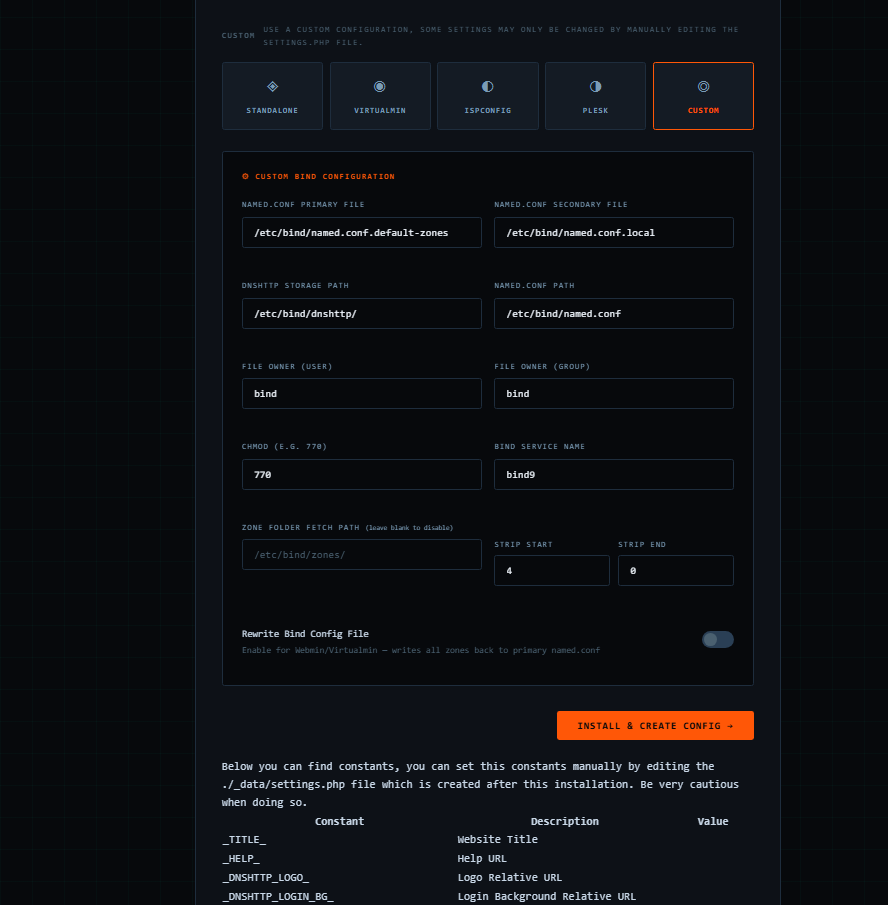

# Screenshots

This section showcases key screenshots of the project, highlighting its features and user interface. Explore these visuals to get a better understanding of how the software works and looks in action.

-------------------

## General

  

  
  
  

  

  

  
  
  
  

## Installation

  

  

  

